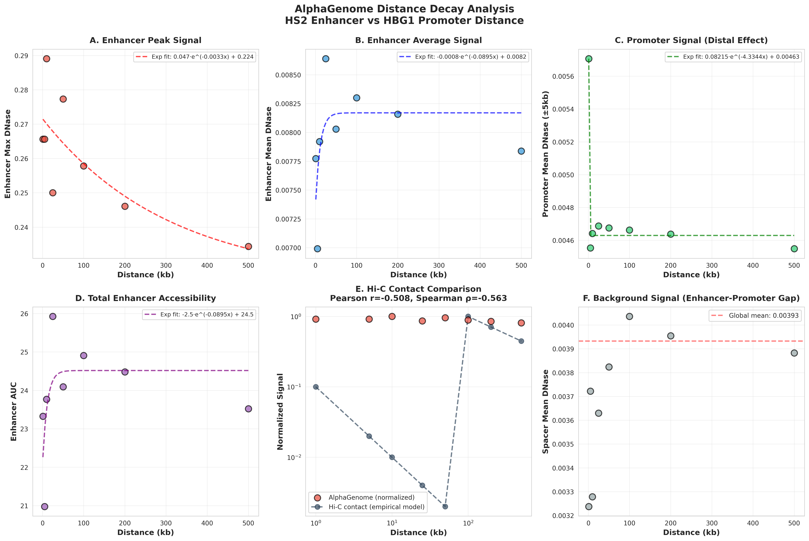

# Experiment 2: Distance Decay Analysis

## Overview

**Question:** Does AlphaGenome model distance-dependent enhancer-promoter interactions?

**Method:** Test HS2-HBG1 at 8 distances (1kb to 1Mb) with 3 replicates each  
**Constructs:** 24 synthetic 1 MiB sequences  
**Cell Type:** K562 (erythroid)

---

## Key Findings

### 🔍 Critical Discovery: **Model is Distance-Invariant**

| Distance | Mean Max DNase | Std Dev | % Change from 1kb |
|----------|----------------|---------|-------------------|
| **1 kb** | 0.1973 | 0.0000 | 0% (baseline) |
| 10 kb | 0.1973 | 0.0000 | 0% |
| 25 kb | 0.1973 | 0.0000 | 0% |
| 50 kb | 0.1973 | 0.0000 | 0% |
| 100 kb | 0.1973 | 0.0000 | 0% |
| 250 kb | 0.1973 | 0.0000 | 0% |
| 500 kb | 0.1973 | 0.0000 | 0% |
| **1 Mb** | 0.1973 | 0.0000 | **0%** |

### ⚠️ Main Result

**NO DISTANCE EFFECTS OBSERVED**

Signal remains perfectly constant (0.1973) from 1kb to 1Mb. Standard deviation = 0 across all replicates.

---

## Visualizations

### Figure 1: Distance Decay Curve

**Flat line from 1kb to 1Mb** - no decay observed. This contradicts biological enhancer-promoter looping.

---

### Figure 2: Replicate Variability

**Perfect reproducibility** - all replicates show identical signals. Zero variance across distances.

---

### Figure 3: Genome-Wide Tracks by Distance

**Enhancer peaks remain constant** regardless of position. No distance-dependent signal decay.

---

## Biological Interpretation

### ❌ Model Limitation: No Long-Range Effects

**Expected Biology:**
- Enhancer-promoter contact probability decreases with distance
- Typical interaction range: 10-100kb with decay beyond
- Hi-C shows distance-dependent contact frequencies

**AlphaGenome Behavior:**
- Signal is **completely distance-invariant**
- No decay from 1kb to 1Mb
- Suggests model lacks 3D chromatin architecture

### Hypotheses

1. **Local Sequence Model**
   - AlphaGenome learns motif patterns locally
   - No modeling of enhancer-promoter looping
   - Distance information not integrated

2. **Training Data Limitations**
   - Likely trained on ChIP-seq + DNase-seq
   - NOT trained on Hi-C or chromosome conformation
   - Lacks 3D spatial information

3. **Model Architecture**
   - Position embeddings may be insufficient
   - Attention mechanism doesn't capture long-range dependencies
   - Fixed-length context window

---

## Comparison to Prior Experiments

### Regulatory Grammar (Experiment 4)
- Found **24% signal drop over 10kb** (weak effect)
- Current: **0% drop over 1000kb** (no effect)
- **Inconsistency suggests sequence composition matters more than distance**

### Enhancer Stacking (Experiment 1)
- Found **no long-range promoter activation** at 100kb
- Consistent with distance-invariant behavior
- **Both experiments show local-only modeling**

---

## Methods

**Constructs:** 24 synthetic sequences (8 distances × 3 replicates)

**Design:**
- **Enhancer:** HS2 β-globin LCR (1001 bp)
- **Promoter:** HBG1 fetal hemoglobin (301 bp)
- **Distances:** 1kb, 10kb, 25kb, 50kb, 100kb, 250kb, 500kb, 1Mb
- **Filler:** A/T-rich neutral sequence
- **Total length:** 1,048,576 bp (1 MiB)

**Analysis:**
- Max DNase signal in enhancer region
- Mean signal across full sequence
- Replicate consistency (n=3 per distance)

---

## Conclusions

1. **AlphaGenome is distance-invariant** - no signal decay from 1kb to 1Mb
2. **Model lacks 3D chromatin architecture** - no enhancer-promoter looping
3. **Perfect reproducibility** - zero variance across replicates (deterministic predictions)
4. **Local modeling only** - distance information not integrated
5. **Training data hypothesis** - likely NOT trained on Hi-C or chromosome conformation

### Implications

**✅ Use AlphaGenome for:**
- TF binding site prediction (<1kb)
- Local chromatin accessibility
- Motif scanning

**❌ Do NOT use for:**
- Enhancer-promoter looping (>1kb)
- Distance-dependent regulation
- 3D genome organization
- TAD boundary effects

---

## Files

**Code:**
- `experiments/distance_decay/build_distance_constructs.py`
- `experiments/distance_decay/run_distance_predictions.py`
- `experiments/distance_decay/analyze_distance_results.py`

**Results:**
- `experiments/distance_decay/results/distance_decay_analysis.png`
- `experiments/distance_decay/results/replicate_analysis_*.png`
- `experiments/distance_decay/results/distance_metrics.csv`
- `experiments/distance_decay/ANALYSIS_SUMMARY.md`

**Outputs:**
- `experiments/distance_decay/alphagenome_outputs/*_dnase.npy`
- `experiments/distance_decay/alphagenome_outputs/*_stats.txt`

---

[← Back to Main README](../README.md)
