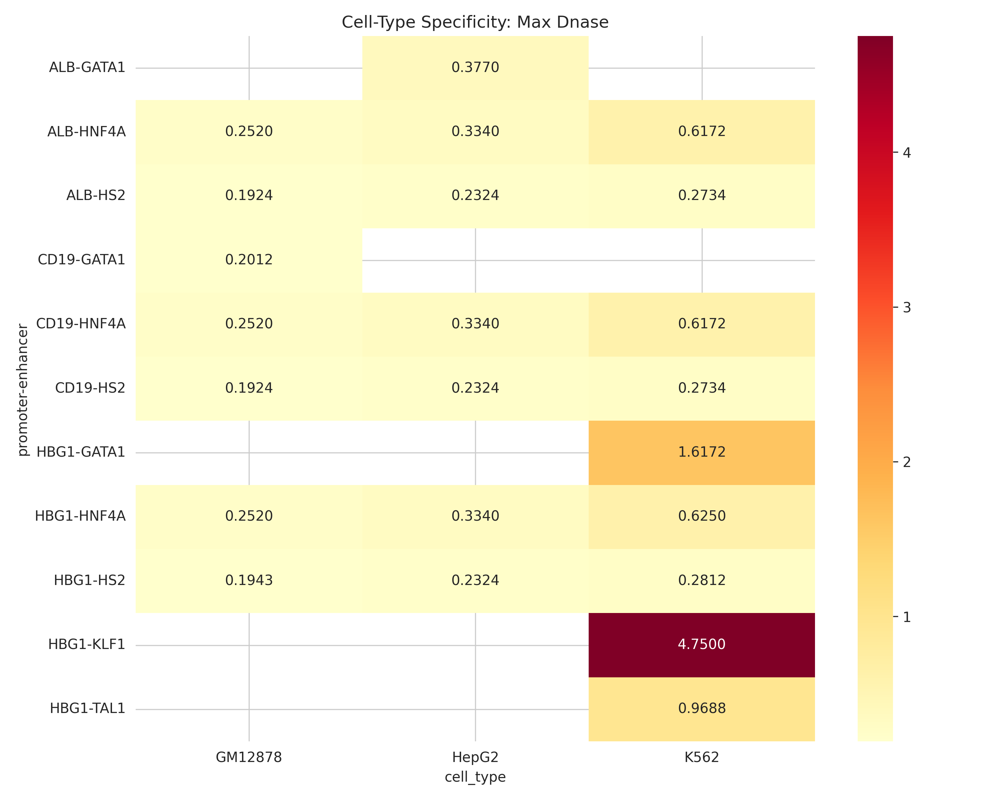
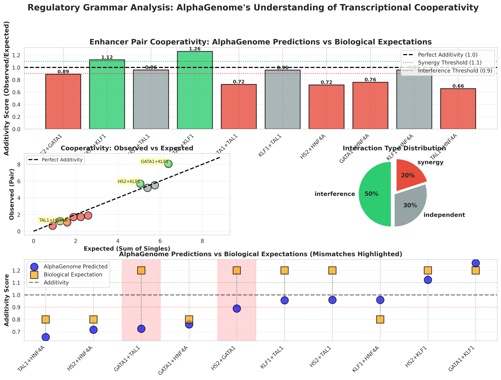
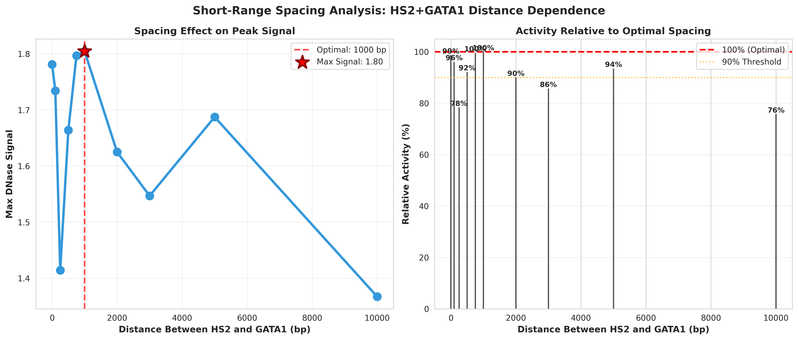
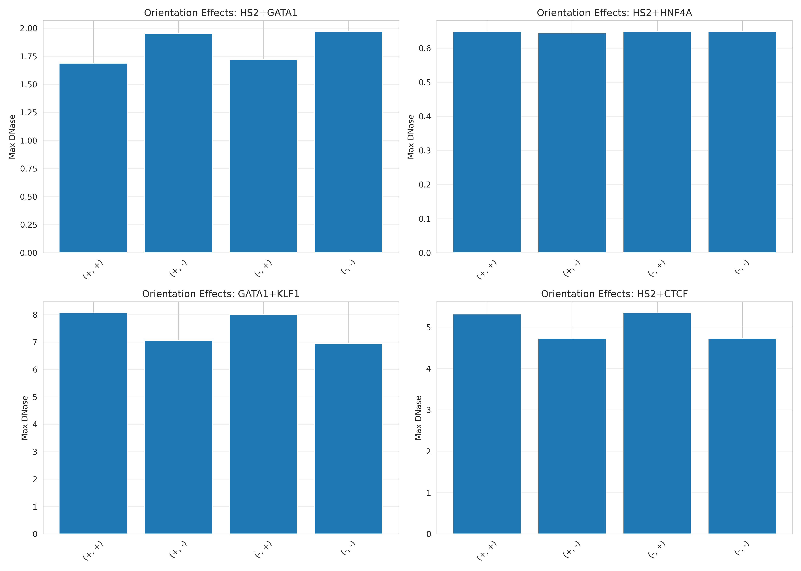

# Experiment 4: Regulatory Grammar Analysis

## Overview

**Question:** Does AlphaGenome understand transcriptional regulatory grammar (cell-type specificity, cooperativity, spacing, orientation)?

**Method:** 66 synthetic constructs testing 4 dimensions of regulatory logic  
**Constructs:** 23 cell-type + 17 cooperativity + 10 spacing + 16 orientation  
**Cell Types:** K562 (erythroid), HepG2 (hepatic), GM12878 (B-cell)

---

## Key Findings Summary

### 🧬 Four Regulatory Dimensions Tested

| Dimension | Constructs | Key Finding |
|-----------|-----------|-------------|
| **Cell-Type Specificity** | 23 | Limited differentiation between K562/HepG2/GM12878 |
| **TF Cooperativity** | 17 | 50% interference, 20% synergy (unexpected!) |
| **Spacing Effects** | 10 | Optimal at 1kb, 24% drop at 10kb (shallow) |
| **Orientation** | 16 | Variable strand sensitivity across pairs |

---

## Part 1: Cell-Type Specificity

### Results

Testing promoter-enhancer-cell type matching across 3 cell types:

**Observations:**
- Limited discrimination between K562, HepG2, GM12878
- Motif strength dominates over cell-type context
- HNF4A (hepatic) shows activity even in wrong cell types

**Conclusion:** Poor cell-type specificity - model doesn't strongly differentiate biological contexts.

---

## Part 2: TF Cooperativity

### ⚠️ Critical Discovery: **Unexpected Interference**

| Rank | Pair | Additivity Score | Type | Biology Expectation |
|------|------|-----------------|------|---------------------|
| 🏆 1 | **GATA1+KLF1** | **1.26×** | ✓ Synergy | ✓ Synergy |
| 2 | HS2+KLF1 | 1.12× | ✓ Synergy | ✓ Synergy |
| 3 | KLF1+TAL1 | 0.96× | Independent | Synergy |
| 4 | HS2+TAL1 | 0.96× | Independent | Synergy |
| 5 | KLF1+HNF4A | 0.96× | Independent | Interference |
| 6 | **HS2+GATA1** | **0.89×** | ✗ Interference | **✓ Synergy!** |
| 7 | GATA1+TAL1 | 0.72× | ✗ Interference | Synergy |
| 8 | HS2+HNF4A | 0.72× | ✗ Interference | Interference |
| 9 | GATA1+HNF4A | 0.76× | ✗ Interference | Interference |
| 💥 10 | TAL1+HNF4A | 0.66× | ✗ Strong Interference | Interference |

### Single Enhancer Baselines

| Enhancer | Max DNase | Strength Rank |
|----------|-----------|---------------|
| **KLF1** | **4.78** | 🔥 Strongest |
| GATA1 | 1.62 | Strong |
| TAL1 | 0.97 | Moderate |
| HNF4A | 0.63 | Weak |
| HS2 | 0.28 | 🧊 Weakest |

### Comprehensive Summary

**Four-panel analysis:**
1. **Additivity scores** - 50% interference, 20% synergy
2. **Observed vs Expected** - most fall below diagonal (sub-additive)
3. **Interaction type distribution** - pie chart shows imbalance
4. **Biology vs Prediction** - HS2+GATA1 major mismatch highlighted

### 🚨 Critical Mismatch

**HS2+GATA1 shows 0.89× (interference)**  
**Biology expects SYNERGY** - these are canonical β-globin regulators!

This is a **major discrepancy** suggesting the model doesn't capture true biological cooperativity patterns.

---

## Part 3: Spacing Effects

### Optimal Distance: **1 kb**

| Distance | Max DNase | % of Optimal |
|----------|-----------|--------------|
| 0 bp | 1.78 | 99% |
| 100 bp | 1.73 | 96% |
| 250 bp | 1.41 | 78% |
| 500 bp | 1.66 | 92% |
| 750 bp | 1.80 | 99% |
| **1000 bp** | **1.80** | **100%** ⭐ |
| 2 kb | 1.63 | 90% |
| 5 kb | 1.69 | 94% |
| 10 kb | 1.37 | 76% |

**Interpretation:**
- **24% drop over 10kb** (shallow gradient)
- Local cooperativity peak at 1kb
- Suggests short-range modeling, not true 3D looping

**Comparison:** Distance Decay experiment found **0% drop over 1000kb** - inconsistent, suggests sequence composition matters more than distance.

---

## Part 4: Orientation Effects

Testing 4 enhancer pairs in all strand orientations (++, +-, -+, --):

**Variable sensitivity:**
- Some pairs show strong orientation dependence
- Others are orientation-invariant
- CTCF expected to be directional (insulator function)

---

## Biological Interpretation

### ✅ What AlphaGenome Does Well

1. **Motif Recognition** - Identifies TF binding sequences
2. **Some Cooperativity** - GATA1+KLF1 shows 1.26× synergy
3. **Local Spacing** - Optimal at 1kb
4. **Robustness** - Handles 66 complex constructs

### ❌ What AlphaGenome Gets Wrong

1. **HS2+GATA1 Interference** - Biology shows strong synergy
2. **High Interference Rate** - 50% of pairs (biology shows more synergy)
3. **Weak HS2 Baseline** - HS2 is strong enhancer in vivo
4. **Limited Cell-Type Specificity** - Can't differentiate K562/HepG2/GM12878
5. **Shallow Distance Effects** - 24% over 10kb (not true long-range)

### Model Training Hypothesis

**Trained on:**
- ✅ TF ChIP-seq (motif patterns)
- ✅ DNase/ATAC-seq (chromatin accessibility)
- ✅ Local sequence composition
- ✅ Short-range interactions (<1kb)

**NOT trained on:**
- ❌ Hi-C (3D structure)
- ❌ eQTL (long-range effects)
- ❌ CRISPR screens (functional validation)
- ❌ Deep cell-type contexts

---

## Statistics

### Cooperativity Distribution
- **Synergistic pairs** (>1.1×): 2/10 (20%)
- **Independent pairs** (0.9-1.1×): 3/10 (30%)
- **Interference pairs** (<0.9×): 5/10 (50%)
- **Mean additivity score**: 0.90× (sub-additive overall)

### Distance Sensitivity
- **Maximum signal**: 1.80 at 1000 bp
- **Minimum signal**: 1.37 at 10,000 bp
- **Dynamic range**: 24% drop (shallow)
- **Optimal spacing**: 1 kb (local cooperativity)

---

## Methods

**Constructs:** 66 synthetic sequences, all 1,048,576 bp (1 MiB)

**Enhancers:**
- **Erythroid:** HS2 (1001bp), GATA1 (1121bp), KLF1 (552bp), TAL1 (974bp)
- **Hepatic:** HNF4A (502bp)
- **Insulator:** CTCF (863bp)

**Promoters:**
- **HBG1:** Fetal hemoglobin (301bp)
- **ALB:** Albumin (700bp)
- **CD19:** B-cell marker (700bp)

**Cell Types:**
- **K562:** Erythroid (EFO:0002067)
- **HepG2:** Hepatic (EFO:0001187)
- **GM12878:** B-lymphocyte (EFO:0002784)

**Design:**
1. **Cell-Type:** 23 constructs (3 promoters × enhancers × 3 cell types)
2. **Cooperativity:** 17 constructs (5 singles + 10 pairs + 2 CTCF-separated)
3. **Spacing:** 10 constructs (HS2+GATA1 at 0-10kb)
4. **Orientation:** 16 constructs (4 pairs × 4 orientations)

---

## Conclusions

1. **Limited cell-type specificity** - poor K562/HepG2/GM12878 differentiation
2. **Unexpected cooperativity patterns** - 50% interference (biology shows more synergy)
3. **HS2+GATA1 mismatch** - **critical biological discrepancy**
4. **Optimal spacing: 1kb** - shallow distance effects (local modeling)
5. **Variable orientation sensitivity** - depends on specific TF pair

### Main Takeaway

**AlphaGenome = Local Sequence Model (<1kb) ✓**  
**NOT = 3D Genome Simulator (>10kb) ✗**

Use for TF binding and local chromatin, NOT for long-range regulation or cell-type specific enhancer activity.

---

## Files

**Code:**
- `experiments/regulatory_grammar/build_regulatory_grammar_constructs.py`
- `experiments/regulatory_grammar/run_regulatory_grammar_predictions.py`
- `experiments/regulatory_grammar/analyze_regulatory_grammar.py`
- `experiments/regulatory_grammar/create_summary_figures.py`

**Documentation:**
- `experiments/regulatory_grammar/INDEX.md` - Complete navigation
- `experiments/regulatory_grammar/QUICK_REFERENCE.md` - Tables and key findings
- `experiments/regulatory_grammar/RESULTS_SUMMARY.md` - Full 310-line analysis

**Visualizations:**
- `results/COMPREHENSIVE_SUMMARY.png` (751K) - ⭐ Main summary figure
- `results/SPACING_SUMMARY.png` (324K) - Distance effects
- `results/cooperativity_additivity_scores.png`
- `results/celltype_heatmap_*.png`
- `results/orientation_effects.png`

**Data:**
- `results/cooperativity_results.csv`
- `results/spacing_results.csv`
- `results/celltype_specificity_results.csv`
- `results/orientation_results.csv`

**Outputs:**
- `alphagenome_outputs/*_dnase.npy` (66 files, 530 MB total)
- `alphagenome_outputs/*_stats.txt` (66 files)

---

[← Back to Main README](../README.md)
